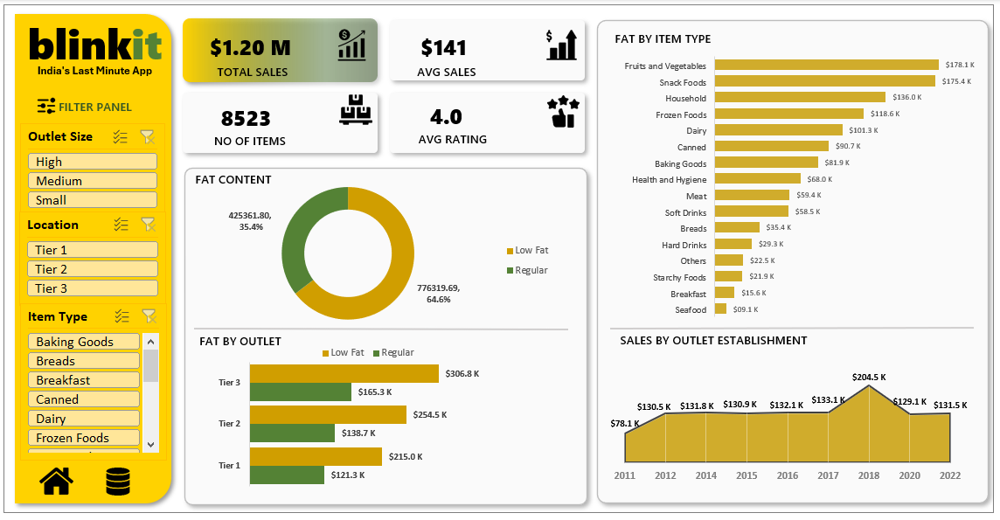

# 🛒 Blinkit Analysis (SQL Report)

This repository contains SQL queries and insights derived from the Blinkit sales dataset. It includes data cleaning, key performance indicators (KPIs), and detailed visual analysis by various attributes.

---

## 1. View Raw Data

**Query:**
```sql
SELECT * FROM blinkit_data;  ```



SELECT CAST(AVG(Rating) AS DECIMAL(10,1)) AS Avg_Rating
FROM blinkit_data;

